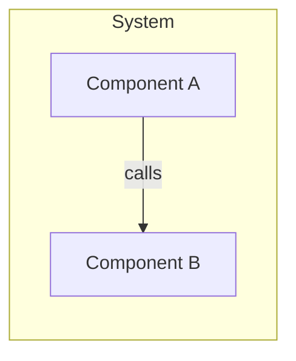
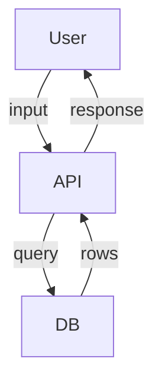
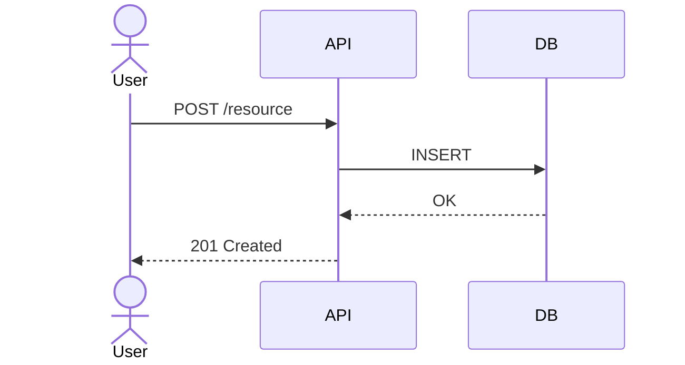
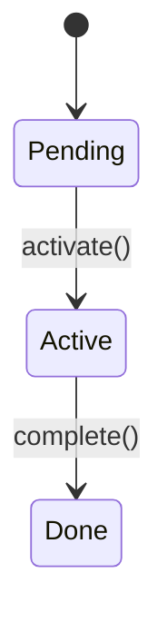

# Context Engineering Skill

> See also: `disciplined-coding` skill (governs code quality within the Implement phase).

The **Context Engineering (CE) pipeline** replaces ad-hoc prompting with a disciplined, artifact-driven workflow. Research data shows skipping Research/Design/Plan phases produces ~1.7× more defects, 8× more performance issues, and +41% extra complexity.

## Pipeline Overview

```
Phase 0  Triage       (orchestrator)   — classify: Trivial | Prototype | Standard
Phase 1  Research     (researcher)     — gather context, produce research.md
         ── Gate 1: user approves research.md ──
Phase 2  Design       (code-investigator) — produce design.md with diagrams
         ── Gate 2: user approves design.md ──
Phase 3  Plan         (orchestrator)   — produce plan.md with ordered phases
         ── Gate 3: user approves plan.md ──
Phase 4  Implement    (coder + reviewer + tester per plan phase)
         ── Final gate: PR created, URL reported ──
```

## Artifact Location

All CE artifacts live **in the target project repo** (not this fabric repo):

```
docs/context-eng/<feature-slug>/
├── README.md        # index: slug, status, gate log
├── research.md      # Phase 1 output
├── design.md        # Phase 2 output (includes Mermaid diagrams)
├── plan.md          # Phase 3 output (ordered phases with acceptance criteria)
└── gates.md         # running gate log (append-only)
```

`<feature-slug>` is a short, lowercase, hyphenated name derived from the feature request (e.g., `user-auth`, `payment-webhook`, `multiplayer-sync`).

### Artifact Templates

#### `README.md` (index)
```markdown
# CE: <Feature Name>

- **Slug:** `<feature-slug>`
- **Mode:** standard | prototype
- **Status:** research | design | plan | implement | done
- **Branch:** `copilot/feat/<feature-slug>`

## Gate Log
| Gate | Status | Notes |
|------|--------|-------|
| Gate 1 — Research | ⏳ pending | |
| Gate 2 — Design   | ⏳ pending | |
| Gate 3 — Plan     | ⏳ pending | |
| Gate 4 — Implement| ⏳ pending | |
```

#### `research.md`
```markdown
# Research: <Feature Name>

## Problem Restatement
<One paragraph. What are we solving, and why does it matter?>

## Success Criteria
- [ ] <Measurable criterion 1>
- [ ] <Measurable criterion 2>

## Affected Codebase Areas
| Area | Files / Symbols | Notes |
|------|-----------------|-------|
| <module> | `src/auth/...` | <reason> |

## Existing Patterns to Follow
- <pattern 1> — found in `path/to/example.ts`
- <pattern 2>

## Prior Art & Options Considered
| Option | Why considered | Decision |
|--------|---------------|---------|
| <lib A> | <reason> | ✅ adopt / ❌ reject — <reason> |

## Constraints
- **Performance:** <e.g., < 50 ms p99>
- **Security:** <e.g., must pass OWASP top-10 audit>
- **Platform / deps:** <e.g., Node 20, no new DB>

## Open Questions
- [ ] <question for user or team>
```

#### `design.md`
```markdown
# Design: <Feature Name>

## Architecture (C4 Component)


## Data Flow Diagram


## Sequence Diagram — Happy Path


## Public Contracts
### Types
```typescript
interface ExampleRequest { ... }
interface ExampleResponse { ... }
```

### Function Signatures
```typescript
async function processResource(req: ExampleRequest): Promise<ExampleResponse>
```

## State Model (if applicable)


## Failure Modes & Rollback
| Failure | Detection | Mitigation |
|---------|-----------|-----------|
| DB timeout | 500 response | retry + circuit breaker |

## Non-Goals
- <What this design explicitly does NOT cover>
```

#### `plan.md`
```markdown
# Plan: <Feature Name>

## Phases

### Phase 1 — <Title>
- **Goal:** <one sentence>
- **Files to touch:** `src/...`
- **Acceptance criteria:**
  - [ ] <testable criterion>
- **Suggested agent:** `code-writer` | `<specialist>`
- **Risk / blast radius:** low | medium | high — <reason>
- **Depends on:** —

### Phase 2 — <Title>
...
```

#### `gates.md`
```markdown
# Gate Log: <Feature Name>

## Gate 1 — Research
- **Status:** ✅ approved | ⏳ pending | ❌ blocked
- **Reviewer notes:** <user comment or auto-pass reason>

## Gate 2 — Design
...

## Implement Phase Gates
### Phase 1 — <Title>
- **Coder result:** <summary>
- **Reviewer notes:** <summary>
- **Tester evidence:** <test output or link>
- **Status:** ✅ passed | ❌ blocked
```

## Phase Specifications

### Phase 0 — Triage

The orchestrator classifies the request before dispatching any agent:

| Class | Criteria | Action |
|-------|----------|--------|
| **Trivial** | Typo, comment change, single-line fix, dep bump, docs-only | Bypass pipeline — delegate directly |
| **Prototype** | User says "prototype", "spike", "sketch", "demo", "throwaway", or `mode: prototype` in prompt | Run pipeline with **relaxed gates** (auto-pass with banner) |
| **Standard** | Any other production code change | Run **full pipeline** with strict gates |

### Phase 1 — Research (no code)

**Lead agent:** `researcher` (+ `code-investigator` for deep codebase recon)

**Output:** `docs/context-eng/<slug>/research.md`

The researcher must populate every section of the research template. Open questions must be answered (or explicitly deferred with user acknowledgment) before Gate 1 can pass.

**Gate 1 protocol (strict mode):**
1. Post `research.md` content or link to the user.
2. Explicitly ask: *"Gate 1: Does this research look complete? Approve to proceed to Design, or request changes."*
3. Wait for explicit user approval. Do NOT proceed until approved.

**Gate 1 protocol (prototype mode):**
- Auto-pass. Append to `gates.md`:
  ```
  > ⚠️ Prototype: Gate 1 auto-passed — research condensed to bullet list.
  ```

### Phase 2 — Design (no code)

**Lead agent:** `code-investigator` (orchestrator coordinates; `documenter` may polish diagrams)

**Output:** `docs/context-eng/<slug>/design.md`

Required diagrams (use `diagram-authoring` skill):
- Architecture / C4 component diagram
- Data Flow Diagram
- At least one Sequence Diagram for the primary interaction

In prototype mode, full diagrams are optional; at minimum one sequence diagram is required for any cross-component flow.

**Gate 2 protocol:** same pattern as Gate 1.

### Phase 3 — Plan (no code)

**Lead agent:** `orchestrator`

**Output:** `docs/context-eng/<slug>/plan.md`

The plan must be **ordered** and **atomic** — each phase is independently implementable and testable. No time estimates (repo convention). Risk level must be declared.

**Gate 3 is the most important gate.** An approved plan is the contract that governs the entire Implement phase. Changes after Gate 3 require a plan amendment (append a `## Amendment` block to `plan.md` and re-seek approval for affected phases).

### Phase 4 — Implement (code allowed)

**Lead:** `orchestrator` sequences phases; dispatches per-phase teams.

For **each phase** in `plan.md`, in order, on branch `copilot/feat/<slug>`:

1. **Coder** — implement the phase against its acceptance criteria. Follow `disciplined-coding` skill.
2. **Reviewer** (`code-reviewer`) — review against `design.md` + this phase's acceptance criteria.
3. **Coder** — apply reviewer feedback.
4. **Tester** (`tester`) — write and run tests; record evidence.
5. Append phase result block to `gates.md`.
6. Commit with conventional message referencing phase ID: `feat(<slug>): phase-<N> — <title>`.

After all phases: open a single PR containing all code + all CE artifacts. Report PR URL.

## Gate Enforcement Protocol

```
orchestrator: [post artifact content or file link]
orchestrator: "Gate N complete. Approve to continue to <next phase>, or reply with changes needed."
user:         "approved" | "changes: ..."
orchestrator: [if approved] → proceed
              [if changes] → dispatch lead agent to revise → re-seek approval
```

**Never skip a gate.** Never auto-approve in strict mode, even if the artifact looks complete.

## Prototype Mode Rules

Activate when the user's message contains any of: `prototype`, `spike`, `sketch`, `demo`, `throwaway`, `poc`, or the prompt includes `mode: prototype`.

| Rule | Strict mode | Prototype mode |
|------|-------------|----------------|
| Gates | Manual approval required | Auto-pass with banner |
| Research | Full `research.md` template | Bullet-list summary |
| Design | Full diagrams required | ≥1 sequence diagram for cross-component flow |
| Plan | Full phase list | Abbreviated phase list |
| Tests | Full test suite | Smoke-level tests |

All gates still get an entry in `gates.md` (with the auto-pass banner).

## MemPalace Integration

Mirror each phase artifact as a drawer keyed on `<project>/<slug>/<phase>`:

```
mempalace_add_drawer(
  key="<project>/<slug>/research",
  content=<research.md summary>,
  tags=["ce-pipeline", "<slug>", "research"]
)
```

Before starting each phase, query MemPalace:
```
mempalace_search(query="<slug> <phase>", wing=<project>)
```

If a prior CE run for the same slug exists (similarity ≥ 0.3), surface it to the user before overwriting.

## When to Use

- Any non-trivial production code change (new feature, significant refactor, new integration)
- Multi-agent feature work where design decisions affect multiple files/modules
- Any work where a review of requirements before coding would prevent wasted effort

## When NOT to Use

- Trivial changes (typos, single-line fixes, comment updates, dep bumps)
- Pure documentation updates
- Hotfixes where the root cause is already understood (can start at Plan phase)
