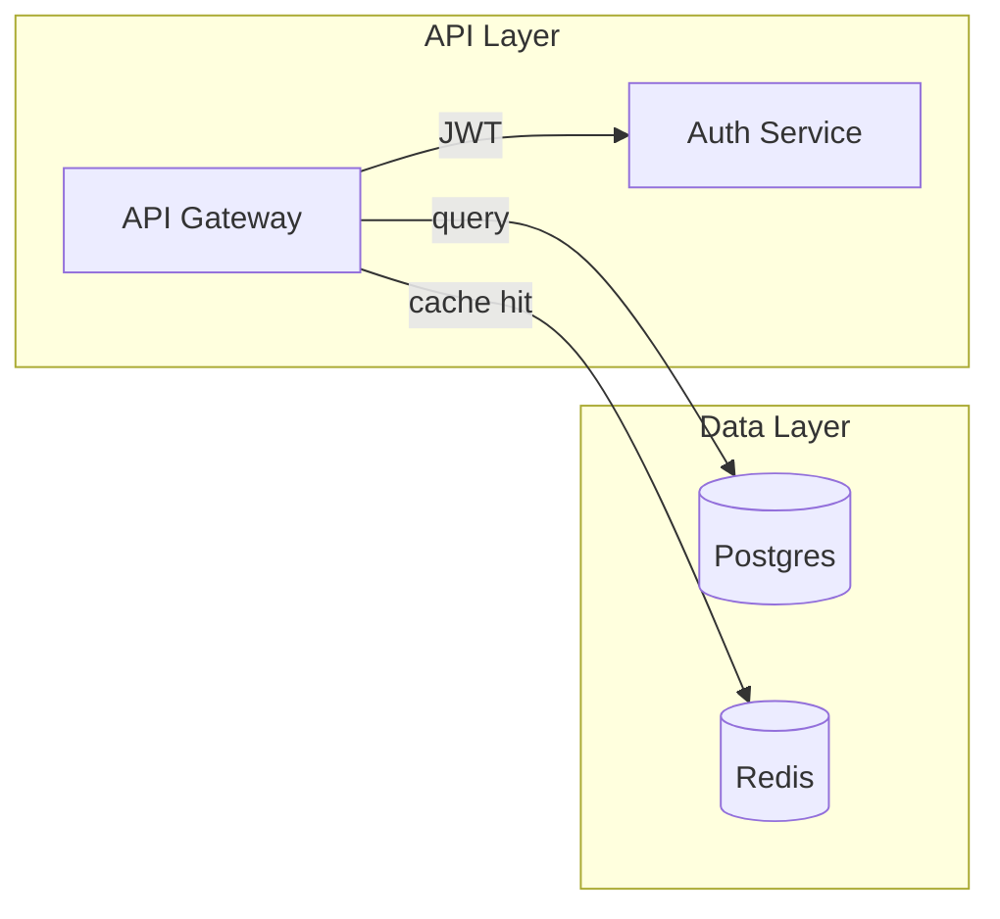
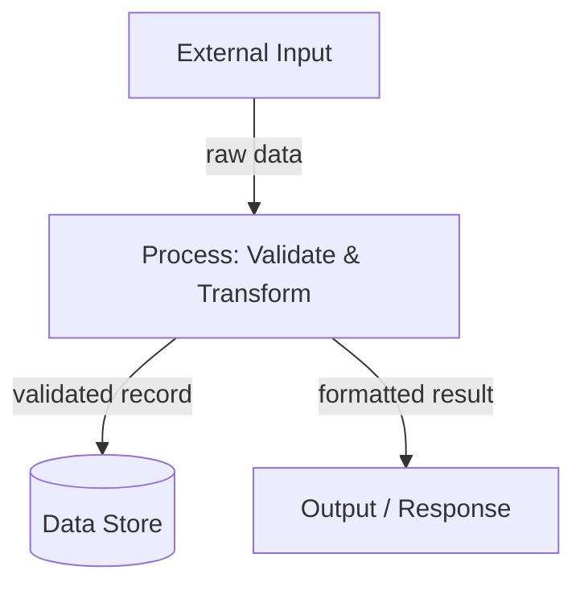
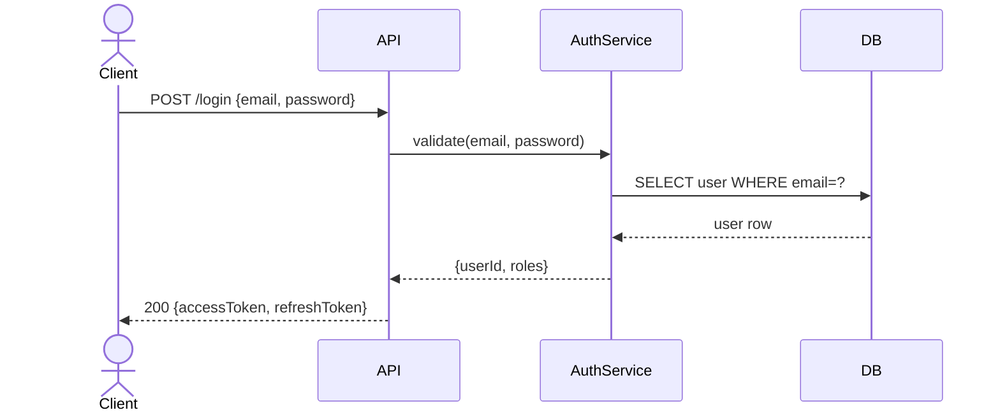
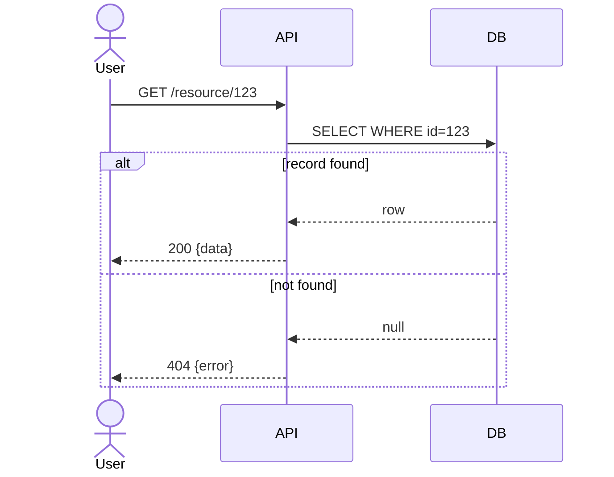
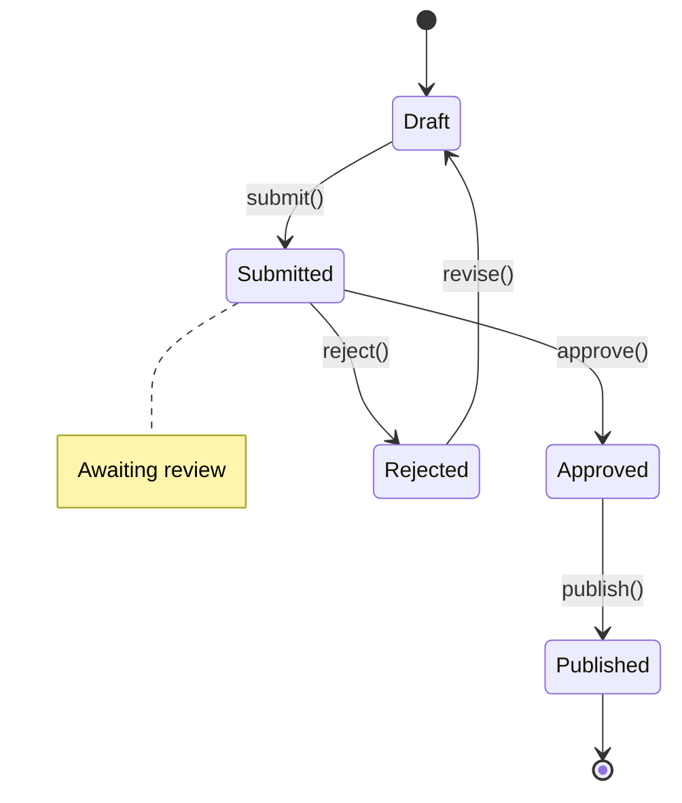

# Diagram Authoring Skill

Guidance for producing clear, valid Mermaid diagrams in the CE Design phase. All diagrams must render correctly in GitHub Markdown.

## Diagram Types

### C4 Component Diagram

Use `graph LR` or `graph TD` to show how components relate within a system boundary.

**Rules:**
- Wrap label text in quotes: `["Label"]`
- Group related nodes with `subgraph "Name"`
- Use meaningful edge labels: `-->|"description"|`
- Use `[("Name")]` for databases/stores

### Data Flow Diagram (DFD)

Use `graph TD` (top-down) to trace data through the system.

**Rules:**
- Label every arrow with the data being passed
- External entities use plain rectangles
- Processes use rounded rectangles or plain nodes
- Data stores use `[("Name")]`

### Sequence Diagram

Use `sequenceDiagram` for interaction flows, API calls, and event sequences.

**Rules:**
- Use `actor` for humans/external systems, `participant` for internal services
- Solid arrow `-->` for requests, dashed arrow `-->>` for responses
- Add `activate X` / `deactivate X` for long-running operations
- Use `alt` / `else` / `end` for conditional branches
- Use `Note over A,B: text` for annotations

#### Sequence with Error Branch

### State Machine Diagram

Use `stateDiagram-v2` for entity lifecycle or UI state.

**Rules:**
- `[*]` is the start/end state
- Transitions: `State --> State : event()`
- Add `note` for context on key states

## Best Practices

1. **One diagram per concern** — don't cram everything into one diagram. Separate architecture, data flow, and sequence into distinct diagrams.
2. **Verify syntax** — always validate that the Mermaid block has matching `subgraph`/`end`, `alt`/`end`, etc. Unclosed blocks silently fail to render on GitHub.
3. **Label all edges** — unlabeled arrows force readers to guess; always state what flows between nodes.
4. **Consistent naming** — use the same node names/aliases across diagrams for the same component.
5. **Keep it scoped** — each diagram covers one interaction or one subsystem; link diagrams in prose with "see Sequence Diagram above".
6. **No time estimates** — diagrams must not include duration or timeline information (repo convention).
7. **Avoid emojis in Mermaid** — they break rendering in some viewers; keep labels plain text.

## When to Use

- **C4 Component** — at the start of the Design phase to establish system boundaries
- **DFD** — whenever data transformation is a key concern (APIs, ETL, event pipelines)
- **Sequence** — for every non-trivial interaction (API calls, event flows, auth flows, multi-actor workflows)
- **State Machine** — when an entity has a meaningful lifecycle (orders, sessions, game states, workflow stages)
