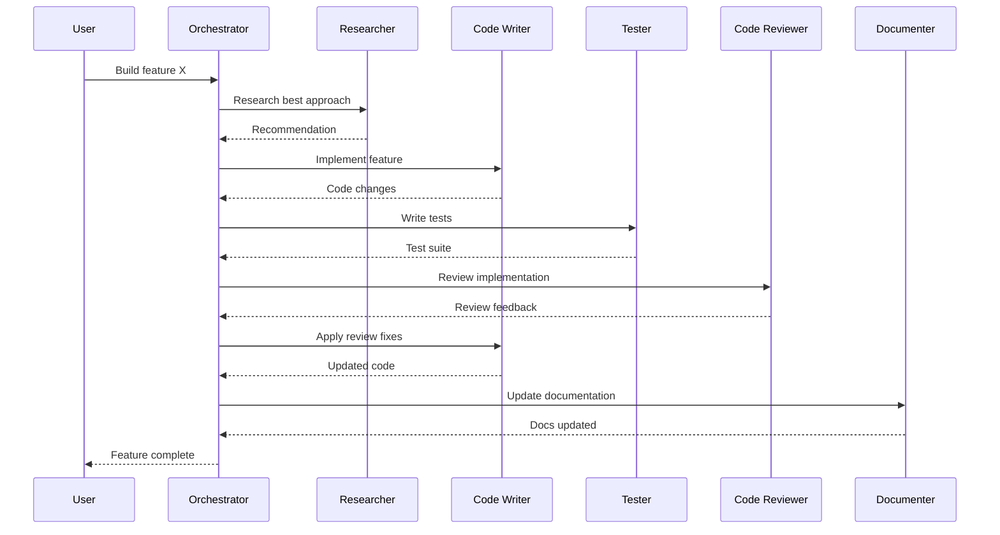
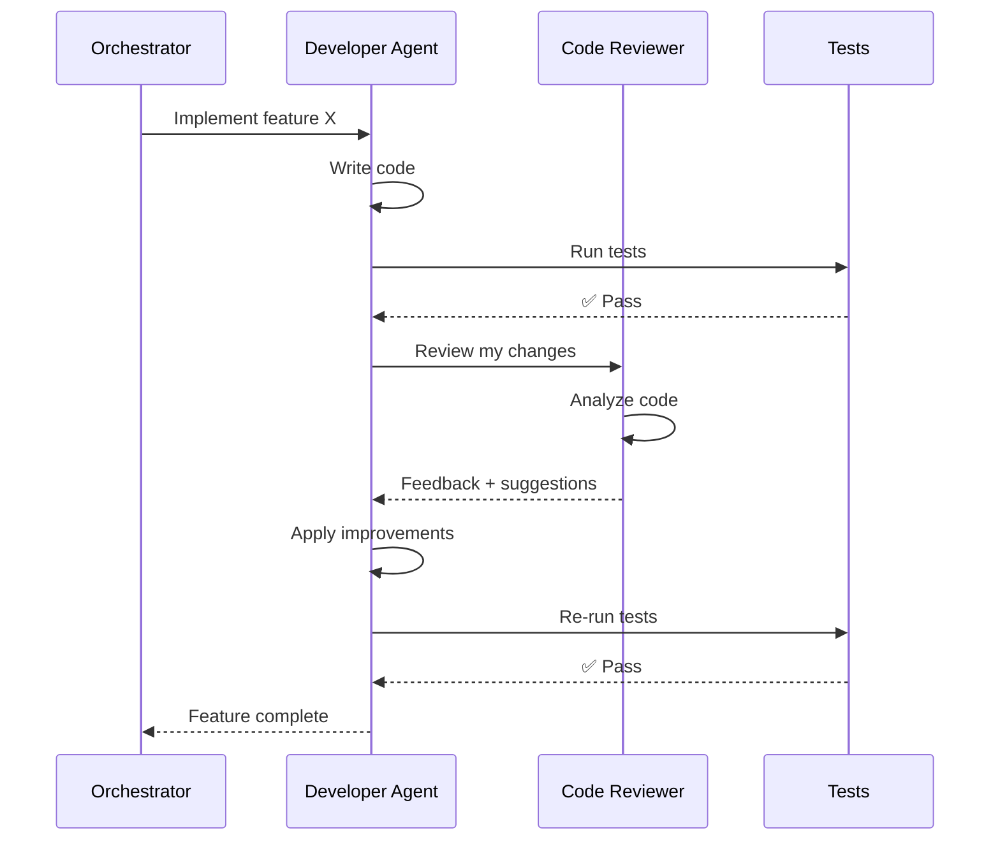
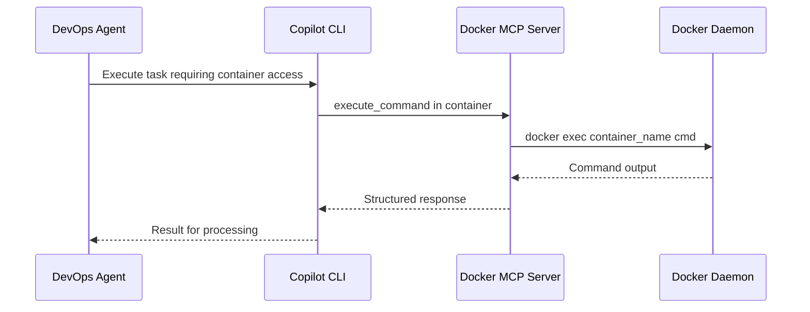

# System Architecture

## Overview

This workspace implements a **multi-agent system** managed through GitHub Copilot CLI. Each agent is a specialized Markdown-based instruction set that guides Copilot's behavior for specific tasks.

## Architecture Diagram

```mermaid
graph TD
    User[👤 User] --> CLI[Copilot CLI]
    CLI --> Orchestrator[🎯 Orchestrator]

    Orchestrator --> CodeWriter[✍️ Code Writer]
    Orchestrator --> CodeReviewer[🔍 Code Reviewer]
    Orchestrator --> Tester[🧪 Tester]
    Orchestrator --> Documenter[📝 Documenter]
    Orchestrator --> DevOps[⚙️ DevOps]
    Orchestrator --> Researcher[🔬 Researcher]
    Orchestrator --> CodeInvestigator[🔎 Code Investigator]

    AgentCreator[🆕 Agent Creator] --> |creates| NewAgent[New Agent]
    AgentCreator --> |creates| NewSkill[New Skill]
    NewAgent --> Registry[(Registry)]
    NewSkill --> Registry

    subgraph Skills ["🛠️ Skills (Reusable Capabilities)"]
        FileOps[📂 File Operations]
        Terminal[💻 Terminal Commands]
        CodeGen[🏗️ Code Generation]
        CodeAna[🔎 Code Analysis]
        WebSearch[🌐 Web Search]
        SecAudit[🛡️ Security Audit]
        DepMgmt[📦 Dependency Mgmt]
        MdGen[📄 Markdown Gen]
        Docker[🐳 Docker]
        CICD[🔄 CI/CD]
        DBOps[🗄️ Database Operations]
        APIDesign[🔗 API Design]
        FrontendFW[⚛️ Frontend Frameworks]
        Observe[📊 Observability]
        PerfOpt[⚡ Performance Optimization]
        TestInfra[🧪 Testing Infrastructure]
    end

    subgraph MCP ["🔌 MCP Servers"]
        ChromeMCP[🌐 Chrome DevTools]
        DockerMCP[🐳 Docker Server]
        FigmaMCP[🎨 Figma]
    end

    CodeWriter -.-> CodeGen
    CodeWriter -.-> DepMgmt
    CodeWriter -.-> DBOps
    CodeWriter -.-> APIDesign
    CodeWriter -.-> FrontendFW
    CodeWriter -.-> PerfOpt
    CodeReviewer -.-> CodeAna
    CodeReviewer -.-> SecAudit
    CodeReviewer -.-> APIDesign
    CodeReviewer -.-> DBOps
    CodeReviewer -.-> FrontendFW
    Tester -.-> CodeGen
    Tester -.-> Terminal
    Tester -.-> TestInfra
    Tester -.-> PerfOpt
    Documenter -.-> MdGen
    DevOps -.-> Docker
    DevOps -.-> CICD
    DevOps -.-> Terminal
    DevOps -.-> DockerMCP
    DevOps -.-> Observe
    Researcher -.-> WebSearch
    Researcher -.-> CodeAna
    CodeWriter -.-> FigmaMCP
    Documenter -.-> FigmaMCP

    subgraph Config
        Registry
        Prompts[Prompt Templates]
        Instructions[Global Instructions]
        MCPConfig[MCP Configuration]
    end

    CLI --> |loads| MCP
    Orchestrator --> |reads| Registry
    CLI --> |uses| Prompts
    CLI --> |loads| Instructions
```



## Agent Communication Flow



## Code Quality Workflow

All developer agents follow a mandatory code review cycle:



### Workflow Steps

1. **Write** - Developer agent implements the feature
2. **Test** - Run tests to verify functionality
3. **Review** - Code Reviewer analyzes code quality
4. **Improve** - Developer applies improvements
5. **Verify** - Re-run tests to ensure stability
6. **Complete** - Mark work as done

This cycle ensures all code meets quality standards before delivery.

## Layer Model

| Layer | Purpose | Location |
|-------|---------|----------|
| **User Interface** | Copilot CLI chat | Terminal / IDE |
| **Orchestration** | Task decomposition & routing | `.github/agents/orchestrator.agent.md` |
| **Agents** | Specialized task execution (who) | `.github/agents/*.agent.md` |
| **Skills** | Reusable capabilities (how) | `.github/skills/*.skill.md` |
| **MCP Servers** | External tool integration | `~/.copilot/mcp-config.json` |
| **Configuration** | Registry & templates | `.github/agents-config/` |
| **Prompts** | Reusable workflows | `.github/prompts/` |
| **Instructions** | Global behavior rules | `.github/copilot-instructions.md` |

## Key Design Decisions

### Why Markdown-based agents?
- GitHub Copilot natively supports `.agent.md` files in `.github/agents/`
- No runtime dependencies — pure configuration
- Version-controlled alongside the codebase
- Easy to review, modify, and extend

### Why separate agents from skills?
- **Agents** define *who* does the work and *how they think* (persona, judgment, workflow)
- **Skills** define *what capabilities* are available (tools, techniques, best practices)
- This separation enables **reuse**: multiple agents can share the same skill
- It prevents duplicated instructions and keeps agents focused on their role
- Adding a new capability (skill) doesn't require editing every agent

### Why a central registry?
- Single source of truth for all available agents AND skills
- Maps which skills are assigned to which agents
- Enables the orchestrator to discover capabilities dynamically
- Makes it easy to enable/disable agents or skills

### Why prompt templates?
- Standardize common workflows
- Reduce repetitive typing
- Encode best-practice agent coordination patterns

## MCP Server Integration

**Model Context Protocol (MCP)** servers extend the capabilities of Copilot CLI by providing specialized tools that agents can invoke during task execution.

### Available MCP Servers

| Server | Purpose | Tools Provided |
|--------|---------|----------------|
| **Chrome DevTools** | Browser automation and web testing | Page navigation, element interaction, performance profiling, Lighthouse audits |
| **Docker** | Container management and operations | Command execution, file operations, process management inside containers |
| **Figma** | Design-to-code workflows | Design context extraction, screenshots, Code Connect mapping, variable definitions, FigJam diagram generation |

### How MCP Servers Work



### When to Use MCP Servers

- **Chrome DevTools MCP**: UI testing, web scraping, performance audits, accessibility checks
- **Docker MCP**: DevOps workflows, container debugging, isolated command execution, file operations in containers
- **Figma MCP**: Design-to-code workflows, visual QA, asset extraction, Code Connect mapping, FigJam diagrams

### Configuration

MCP servers are configured in `~/.copilot/mcp-config.json`:

```json
{
  "mcpServers": {
    "chrome-devtools": {
      "command": "npx",
      "args": ["-y", "chrome-devtools-mcp@latest"]
    },
    "docker": {
      "command": "npx",
      "args": ["-y", "docker-mcp-server@latest"]
    },
    "figma": {
      "command": "npx",
      "args": ["-y", "@anthropic/figma-mcp@latest"]
    }
  }
}
```

### Architecture Benefits

- **Separation of Concerns**: Complex tool logic lives in MCP servers, keeping agent definitions clean
- **Reusability**: Multiple agents can leverage the same MCP server
- **Extensibility**: New capabilities can be added by installing additional MCP servers
- **Maintenance**: MCP servers are updated independently from agent definitions

📚 **Learn more**: See [Docker MCP Guide](docker-mcp-guide.md) and [Figma MCP Guide](figma-mcp-guide.md) for detailed usage.
