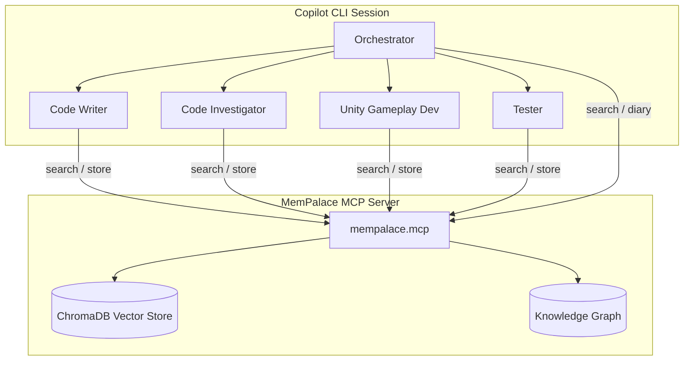

# MemPalace Integration Guide

MemPalace gives agents persistent memory across sessions. Knowledge is stored as **drawers** organized into **wings** (projects) and **rooms** (topics), with a **knowledge graph** for entity relationships.

## Architecture



## How It Works — Complete Lifecycle

Agents with the `mempalace-memory` skill follow a three-phase protocol. See `.github/skills/mempalace-memory.skill.md` for the full specification.

### Session Start (automatic)
1. `mempalace_status` → confirm connectivity, see palace overview
2. `mempalace_diary_read(last_n=5)` → recall recent session history
3. `mempalace_kg_query(entity=<agent-name>)` → load competency lessons for the task domain
4. Detect project context → load project registry and `copilot-instructions.md`

### During Work
- **Memory-first**: `mempalace_search` (wing+room filtered) before reading source files
- **KG queries** for entity facts, relationships, and blockers
- **Grep fallback** when all search results have similarity < 0.3
- Store significant findings immediately via `mempalace_add_drawer`

### Session End (6-step checklist)
1. **Diary write** — natural language summary (never AAAK format)
2. **KG add** — new facts + relationships (`part_of`, `calls`, `blocks`, `worked_on_in`)
3. **KG invalidate** — stale facts discovered during the session
4. **Contradiction check** — query singleton predicates, resolve conflicts
5. **Competency update** — store lessons learned + adjust competency level if warranted
6. **Session-index drawer** — NL summary in `mempalace_sessions/session-index`

## Palace Structure

### Wings (Projects)

| Wing | Description |
|------|-------------|
| `tower-defense` | Tower Defense Unity game — architecture, economy, balance, bots, enemies, bugs, UI, editor tools |
| `scary-hotel` | ScaryHotel Unity game — architecture, NavMesh, SceneBootstrapper |
| `agent-fabric` | This repo — agent definitions, skills, conventions |
| `tooling` | Cross-project — environment, MCP config, project registry |

### Standard Rooms

| Room | Content |
|------|---------|
| `architecture` | Core systems, patterns, data flow |
| `economy` | Currency, costs, resource systems |
| `balance` | Tuning values, enemy stats, wave composition |
| `gameplay` | Mechanics, combat, interactions |
| `bots` | AI behavior, roles, pathfinding |
| `enemies` | Enemy types, spawning, behavior |
| `bugs` | Critical bugs and their fixes |
| `ui` | HUD, menus, input handling |
| `editor` | Editor tools, bootstrappers |
| `art` | Visual style, sprite generation |
| `timeline` | Development chronology |
| `environment` | Dev machine versions and paths |
| `mcp` | MCP server configuration |
| `agents` | Agent definitions and conventions |

## Which Agents Use It

The `mempalace-memory` skill is assigned to agents that benefit from cross-session knowledge:

| Agent | How It Uses MemPalace |
|-------|----------------------|
| **orchestrator** | Reads diary on session start; searches before delegating |
| **code-writer** | Searches for patterns and gotchas before implementing |
| **code-investigator** | Searches for known bugs; stores root cause findings |
| **code-reviewer** | Checks known patterns and past issues during review |
| **tester** | Searches for known failure patterns; stores test findings |
| **unity-gameplay-developer** | Searches Unity-specific gotchas; stores gameplay findings |
| **game-designer** | Searches balance data and past tuning decisions |

## MCP Configuration

MemPalace runs as a stdio MCP server. Config is in `~/.copilot/mcp-config.json`:

```json
{
  "mcpServers": {
    "mempalace": {
      "type": "stdio",
      "command": "C:\\Users\\User\\AppData\\Local\\...\\python.exe",
      "args": ["-m", "mempalace.mcp", "--palace-dir", "C:\\Users\\User\\.mempalace"]
    }
  }
}
```

The palace data lives at `~/.mempalace/` using ChromaDB for vector storage.

## Knowledge Graph

The KG stores typed relationships between entities:

```
Tower Defense → uses_engine → Unity6-URP-2D
Tower Defense → has_system → BFS grid pathfinding
Tower Defense → has_system → dual-currency-coins-energy
Tower Defense → has_system → bot-ai-builder-defender-runner
ScaryHotel → uses_engine → Unity6-URP-3D
ScaryHotel → reimplements → Tower Defense
```

Query with `mempalace_kg_query(entity="Tower Defense")` to see all relationships.

**KG naming rules:** Use kebab-case identifiers. No parentheses, backslashes, or special characters.

### Competency Tracking

The KG tracks agent learning across sessions:

| Predicate | Purpose | Example |
|-----------|---------|---------|
| `competency_level` | Current skill level (singleton — one per domain) | `proficient-unity-urp` |
| `learned_lesson` | Specific insight gained | `avoid-manual-cleanup-on-scene-reload` |
| `common_mistake` | Repeated error to watch for | `forgetting-navmesh-invalidate-after-door-destroy` |

Levels: `novice` → `intermediate` → `proficient` → `expert`. See the skill file for full details.

### Session Index

Session summaries are stored as drawers in wing `mempalace_sessions`, room `session-index`. This makes past sessions discoverable via semantic search across all projects and agents.

## Adding New Knowledge

### When to Store

- ✅ Bug root cause + fix that took real investigation
- ✅ Architecture decision with non-obvious rationale
- ✅ Integration gotcha (e.g., "URP 2D doesn't render sprites under mesh renderers")
- ✅ Balance values that took iteration
- ❌ Routine code changes
- ❌ Info already in `copilot-instructions.md`
- ❌ Temporary debugging notes

### Example

```
mempalace_add_drawer(
  wing="tower-defense",
  room="bugs",
  content="Door pass-through bug: enemies walked through doors because NavMesh obstacle carving radius was 0.1. Fixed by setting to 0.5 matching door width.",
  source_file="Assets/Scripts/DoorController.cs"
)
```
